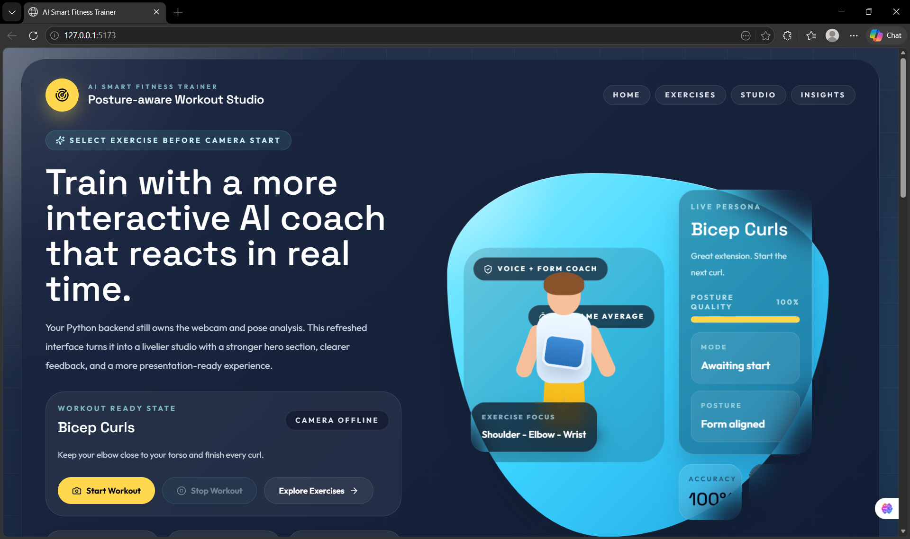
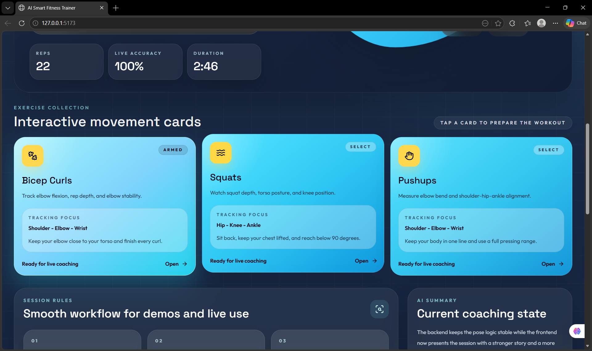
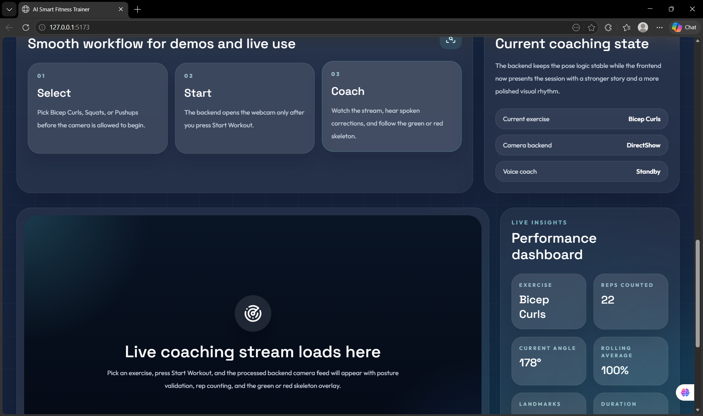
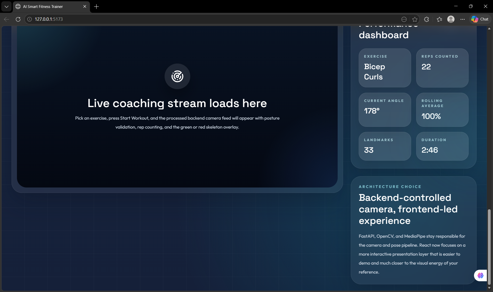
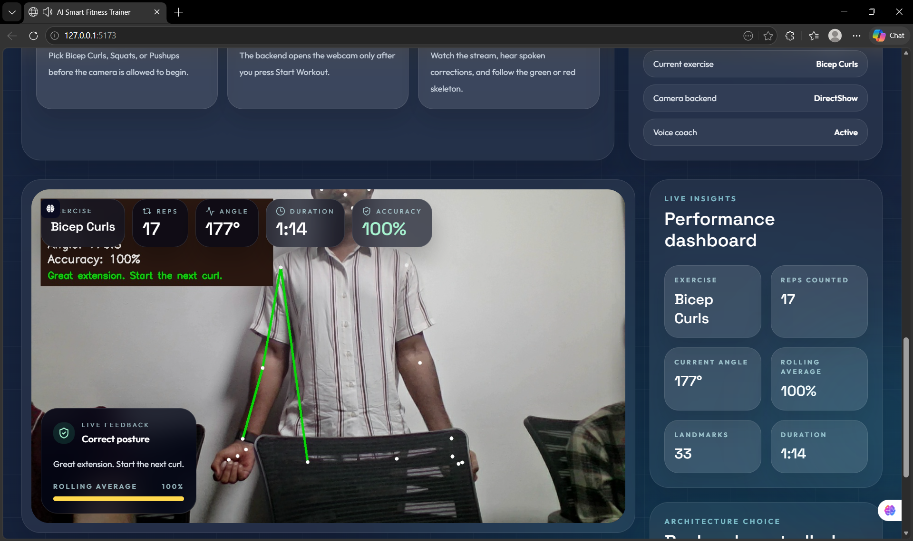
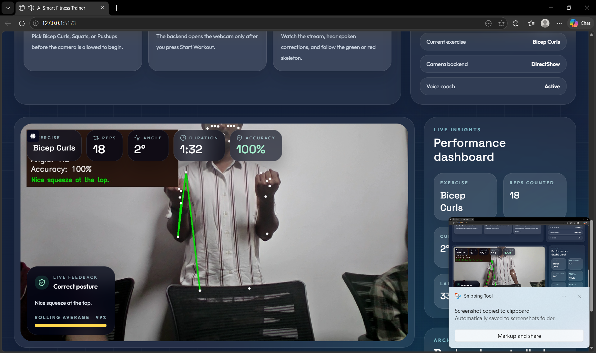
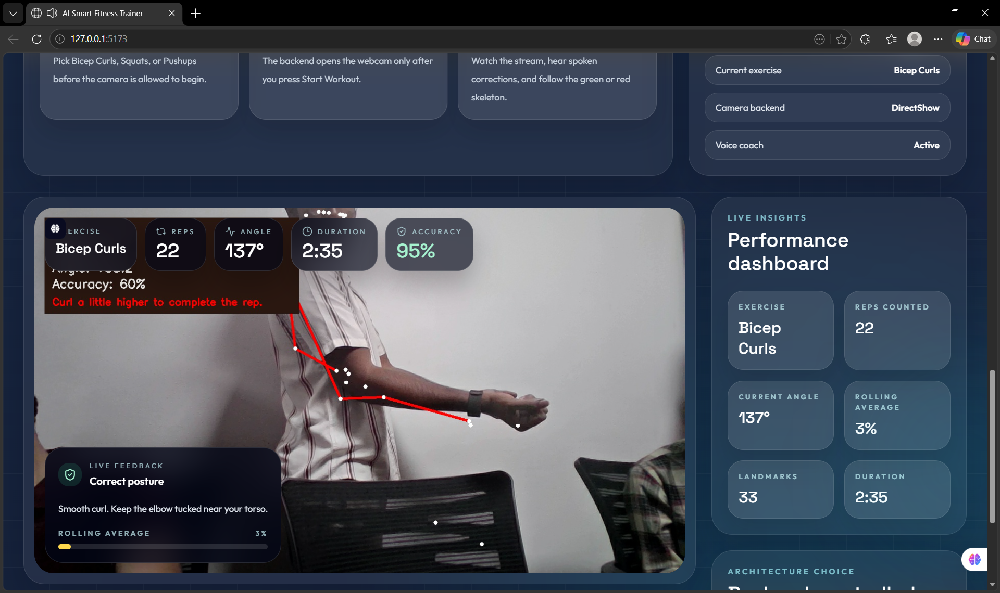

# AI Smart Fitness Trainer using Computer Vision

This project is a complete final-year project with:

- a **React + TypeScript + Vite + Tailwind CSS frontend**
- a **Python + FastAPI + OpenCV + MediaPipe Pose backend**

The system lets the user:

1. select an exercise
2. start the workout session
3. open the webcam from the Python backend
4. detect posture in real time
5. count repetitions
6. validate form
7. display a live skeleton
8. color the skeleton:
   - **GREEN** for correct posture
   - **RED** for incorrect posture

## Important Rule

The camera does **not** start automatically.

The user must **select an exercise first** and then click **Start Workout** in the frontend.

## How This Project Works

This project uses the simplest working full-stack architecture:

- the **backend controls the webcam**
- the backend runs **MediaPipe Pose**, repetition counting, posture validation, and skeleton drawing
- the frontend sends **start** and **stop** commands to the backend
- the frontend displays the **processed video stream** and **live workout metrics**

This is easier to run in VS Code than sending browser frames to Python for every request.

## Project Structure

```text
smart_fitness_trainer/
├── backend/
│   ├── main.py
│   ├── pose_module.py
│   ├── exercise_logic.py
│   ├── utils.py
│   └── requirements.txt
├── frontend/
│   ├── package.json
│   ├── index.html
│   ├── postcss.config.cjs
│   ├── tailwind.config.cjs
│   ├── tsconfig.json
│   ├── vite.config.ts
│   ├── .env.example
│   └── src/
│       ├── components/
│       │   ├── ExerciseCard.tsx
│       │   └── WorkoutOverlay.tsx
│       ├── hooks/
│       │   └── useWorkoutSession.ts
│       ├── pages/
│       │   └── Index.tsx
│       ├── utils/
│       │   └── workout.ts
│       ├── App.tsx
│       ├── index.css
│       └── main.tsx
└── README.md
```

## Features

### Frontend

- exercise selection UI
- explicit **Start Workout** button
- processed live stream viewer
- browser voice coach using Web Speech API
- rep counter
- angle display
- current accuracy and rolling average accuracy
- feedback display
- clean Tailwind dashboard

### Backend

- webcam capture using OpenCV
- pose detection using MediaPipe Pose
- angle calculation using `atan2`
- rep counting for:
  - Bicep Curls
  - Squats
  - Pushups
- posture validation
- rolling posture accuracy scoring
- green/red skeleton drawing
- FastAPI endpoints for frontend communication

## Exercise Logic

### Bicep Curl

- angle uses shoulder, elbow, wrist
- `> 160` means arm is down
- `< 50` means curl is up
- checks elbow drift and full range of motion

### Squat

- angle uses hip, knee, ankle
- `> 160` means standing
- `< 90` means squat depth reached
- checks torso lean and knee position

### Pushup

- angle uses shoulder, elbow, wrist
- `> 160` means top position
- `< 90` means bottom position
- checks body straightness using shoulder, hip, ankle

## Backend API

### `GET /health`

Use this to confirm the backend is running.

### `POST /session/start`

Starts the workout session.

Example request body:

```json
{
  "exercise": "bicep-curl"
}
```

Allowed values:

- `bicep-curl`
- `squat`
- `pushup`

### `POST /session/stop`

Stops the workout session.

### `GET /session/status`

Returns:

```json
{
  "exercise": "bicep-curl",
  "counter": 4,
  "stage": "up",
  "angle": 42.7,
  "accuracy": 91.4,
  "averageAccuracy": 88.9,
  "feedback": "Nice squeeze at the top.",
  "isCorrectForm": true,
  "landmarks": [],
  "isRunning": true,
  "duration": 19,
  "error": null,
  "updatedAt": "2026-04-08T00:00:00+00:00"
}
```

### `GET /video_feed`

Streams the processed OpenCV video with the skeleton and live HUD.

## Prerequisites

Before running the project, make sure you have:

1. **VS Code** installed
2. **Python 3.10, 3.11, or 3.12**
3. **Node.js 18+**
4. a working **webcam**
5. internet access to install Python and npm packages

## Python Version Recommendation

For the backend, use **Python 3.12** if possible.

MediaPipe's published Python package support is safest with Python 3.10 to 3.12.

If you try Python 3.13 or 3.14 and MediaPipe does not install, switch to Python 3.12.

## Screenshots

### 1. Home / Exercise Selection


### 2. Exercise Selection UI


### 3. Workout Started (Camera On)


### 4. Pose Detection & Skeleton


### 5. Rep Counter & Metrics


### 6. Form Feedback (Green/Red)


### 7. Final Output / Summary


## Step-by-Step: Run the Project in VS Code

## Step 1. Open the Project in VS Code

1. Open **VS Code**
2. Click **File -> Open Folder**
3. Select:

```text
C:\Users\ADMIN\Desktop\DHANU\smart_fitness_trainer
```

4. Open a new terminal in VS Code:
   - **Terminal -> New Terminal**

You will need **two terminals**:

- one for the backend
- one for the frontend

## Step 2. Start the Backend

Use the first terminal.

### 2.1 Move into the backend folder

```powershell
cd backend
```

### 2.2 Create a virtual environment

Recommended:

```powershell
py -3.12 -m venv .venv
```


### 2.3 Activate the virtual environment

In PowerShell:

```powershell
.venv\Scripts\Activate.ps1
```

If PowerShell blocks the script, run:

```powershell
Set-ExecutionPolicy -Scope Process Bypass
.venv\Scripts\Activate.ps1
```

### 2.4 Install backend dependencies

```powershell
pip install -r requirements.txt
```

### 2.5 Start the FastAPI backend

```powershell
uvicorn main:app --reload
```

### 2.6 Confirm the backend is running

Open this URL in your browser:

```text
http://127.0.0.1:8000/health
```

You should see a JSON response.

If this works, the backend is ready.

## Step 3. Start the Frontend

Use the second terminal.

### 3.1 Move into the frontend folder

```powershell
cd frontend
```

### 3.2 Install frontend dependencies

```powershell
npm install
```

### 3.3 Optional: create an environment file

If you want to keep the backend URL in an environment file:

```powershell
copy .env.example .env
```

The default API URL is already:

```text
http://127.0.0.1:8000
```

So this step is optional unless you want to edit the backend URL later.

### 3.4 Start the React frontend

```powershell
npm run dev
```

### 3.5 Open the frontend in your browser

Open:

```text
http://127.0.0.1:5173
```

## Step 4. Use the Application

Once both backend and frontend are running:

1. open the frontend page
2. choose one exercise:
   - Bicep Curls
   - Squats
   - Pushups
3. click **Start Workout**
4. wait for the backend webcam stream to appear
5. stand in front of the camera
6. perform the selected exercise
7. watch:
   - repetition count
   - angle
   - accuracy
   - posture feedback
   - browser voice coaching
   - green or red skeleton
8. click **Stop Workout** when finished

## Step 5. Stop the Project

To stop the project:

1. go to the frontend terminal
2. press `Ctrl + C`
3. go to the backend terminal
4. press `Ctrl + C`

If you want to leave the virtual environment:

```powershell
deactivate
```

## One-Click Command Summary

If you just want the exact commands quickly, use this order.

### Backend terminal

```powershell
cd C:\Users\ADMIN\Desktop\DHANU\smart_fitness_trainer\backend
py -3.12 -m venv .venv
.venv\Scripts\Activate.ps1
pip install -r requirements.txt
uvicorn main:app --reload
```

### Frontend terminal

```powershell
cd C:\Users\ADMIN\Desktop\DHANU\smart_fitness_trainer\frontend
npm install
npm run dev
```

## What You Should See

When the project runs correctly:

1. the frontend opens at `http://127.0.0.1:5173`
2. the backend responds at `http://127.0.0.1:8000/health`
3. the frontend shows exercise cards
4. the camera stays off until an exercise is selected
5. after clicking **Start Workout**, the processed video appears
6. the skeleton becomes:
   - green for correct form
   - red for incorrect form
7. the dashboard updates reps, angle, accuracy, and feedback live
8. the browser speaks rep milestones and posture corrections with cooldown protection

## Troubleshooting

### Problem: `py -3.12` is not found

Use:

```powershell
python -m venv .venv
```

But if `pip install -r requirements.txt` fails for MediaPipe, install Python 3.12 and try again.

### Problem: PowerShell says scripts are disabled

Run:

```powershell
Set-ExecutionPolicy -Scope Process Bypass
.venv\Scripts\Activate.ps1
```

### Problem: `npm install` fails

Check:

1. Node.js is installed
2. internet is available
3. you are inside the `frontend` folder

### Problem: backend does not start

Check:

1. you are inside the `backend` folder
2. the virtual environment is activated
3. all requirements are installed

### Problem: `module 'mediapipe' has no attribute 'solutions'`

This means your environment has a newer MediaPipe package installed that removed the
legacy `mediapipe.solutions` API used by this project.

This project is pinned to:

```text
mediapipe==0.10.21
```

Fix it like this:

```powershell
cd backend
.venv\Scripts\Activate.ps1
pip uninstall -y mediapipe
pip install --no-cache-dir -r requirements.txt
```

If it still fails, recreate the backend virtual environment completely:

```powershell
cd backend
deactivate
Remove-Item -Recurse -Force .venv
py -3.12 -m venv .venv
.venv\Scripts\Activate.ps1
pip install --no-cache-dir -r requirements.txt
uvicorn main:app --reload
```

### Problem: webcam does not open

Close any other app using the camera, for example:

- Camera app
- Zoom
- Google Meet
- Teams

Then restart the backend.

### Problem: stream is blank

Check:

1. backend is running
2. frontend is running
3. browser can reach `http://127.0.0.1:8000/health`
4. you selected an exercise before starting

### Problem: pose detection is unstable

Try:

1. improving room lighting
2. standing farther from the camera
3. keeping your whole body visible
4. reducing background clutter

## Notes

- The backend mirrors the frame once using OpenCV.
- The frontend does not mirror the stream again, so there is no double flip.
- No heavy model training is required.
- MediaPipe Pose is pretrained and ready to use.

## Final Demo Flow

For your final-year project presentation, demonstrate this sequence:

1. open the frontend
2. explain that the camera does not start automatically
3. select an exercise
4. click **Start Workout**
5. show live rep counting
6. show posture feedback
7. show green/red skeleton changes
8. stop the session
